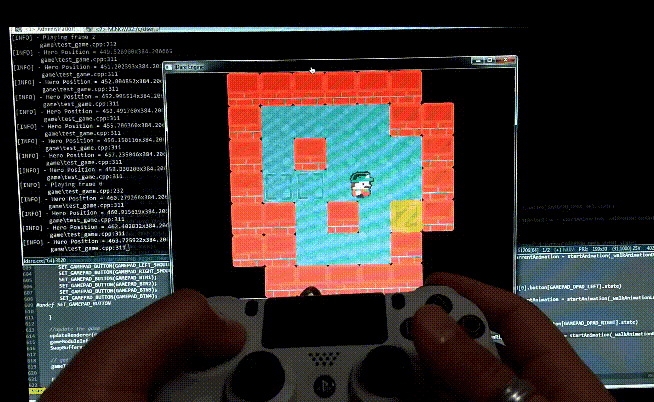

# ldare
ldare is game engine being developed from scratch for the sole purpose of learning and practcing essential game
development skills.
Each and every single feature is written from scratch with absolutely no third party code or libraries.

#ldare and Lundum Dare
The project started as a game engine for creating games for the Lundum Dare Game jam, hence the (provisory) name.
That said, It is resonable to consider the 'next' Lundum Dare as a project milestone for testing and releasing features.

# What can I do with it so far ?
 As the first Lundum Dare approaches, we are in a state where it is already possible to write small 2D games.
  - Fast sprite renderer (no fancy stuff yet)
	- spritesheet support
	- joystick support
	- Good memory management (so far)	

	Hopefully more features will be redy on time for Lundum Dare

